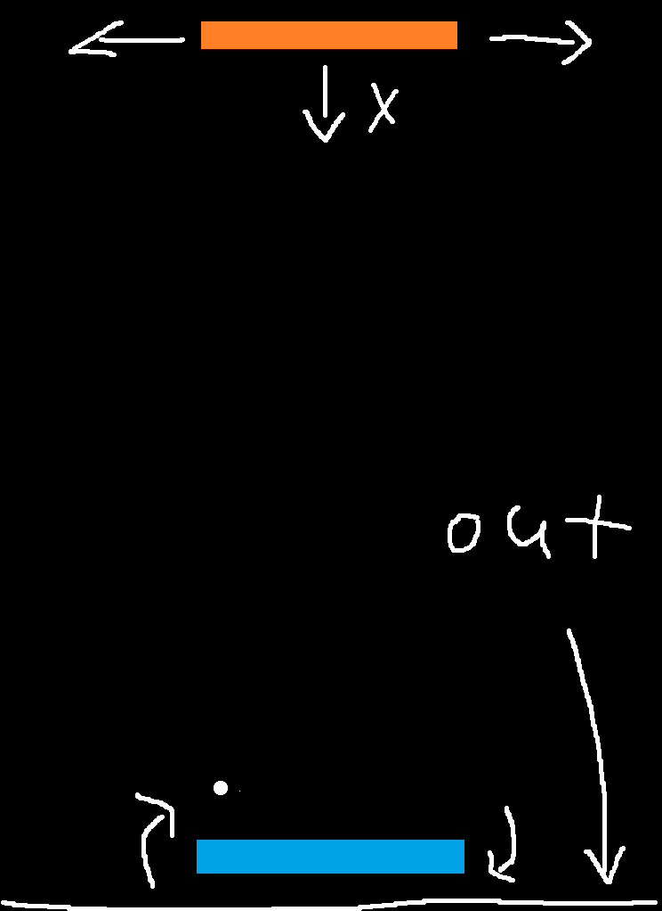
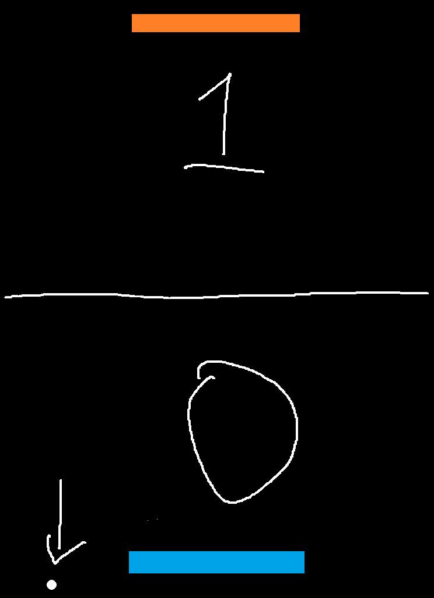

# hockey_game

## 要項
* 二つのコントローラー（ゲームパッドを想定）でプレイ可能なゲームを作成
* ホッケー
* 移動は左右だけ、自機の中心を軸に回転が可能
* 自機は横長い長方形
* 一点取るごとにポイントを取られた側のプレイヤーの斜め上に玉を表示　ー＞　機体を斜めにすることでスタートさせる
* ゲームが終了後リスタートできるようにする

### プレイヤー
* 横移動
* ばねのように動くアクション

  * ボタンが押されている間角度を一定速度で変更　ー＞　規定値で止める　ー＞　ボタンが離されたら現在の角度の数値を負の数になるまで角度を変更。この時の速度は移動量に関わらず一定になるようにする　ー＞　元の状態に戻る。この時の移動時間は移動量によって変化する。

* 

## アドバンス要項
* 二つのコントローラーが接続されるまで待機状態にする（接続されたら球を表示すればいい？）
* 

    

